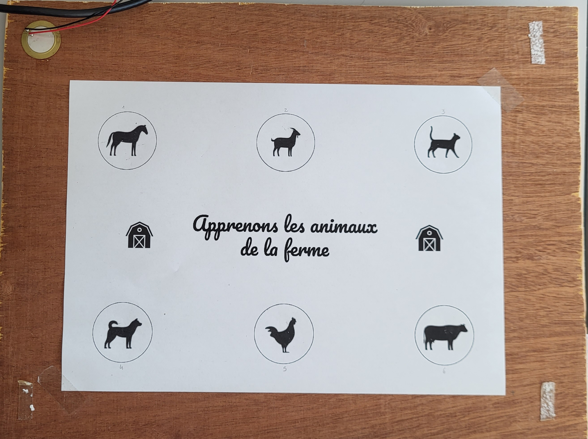

# Real-Time Signal Detection and Classification on a Sensor-Embedded Wooden Board

This project implements a real-time signal detection system using a wooden board with embedded piezoelectric sensors. The signals generated from physical impacts on the board are processed and classified using various signal processing and machine learning techniques, including **k-Nearest Neighbors (k-NN)** for precise classification.

## Features
- **Real-time signal processing**: Detects and classifies signals from physical impacts on a wooden board.
- **Signal normalization and inter-correlation**: Enhances robustness for accurate classification.
- **k-NN classification**: Achieves **100% accuracy** in detecting signal locations on the board.
- **Optimized performance**: Achieves a processing time of less than **250 ms** for each signal.

## Project Structure
- `main.py`: Main script for signal acquisition and classification.
- `interface.py`: Pygame-based interface to visualize and interact with the classified signals.
- `lecture_bd.py`: Functions to handle signal data from the database.
- `py_register.py`: Cross-correlation and signal registration utilities for processing.
- `Variables.json`: Configuration file for paths and constants.
- `case_touchee.json`: Communication file for the detected signal case.

## How It Works

  - Signal Acquisition: Physical impacts on the wooden board are detected via piezoelectric sensors.
    
    *Figure 1: Sensor-embedded wooden board used for signal detection (piezoelectric sensor on the upper left).*
    
    *Figure 2: The signal is acquired using a dedicated card with a sampling rate of 500 kHz (in accordance with the Shannon-Nyquist theorem).*
    
  - Signal Processing: The raw signal is processed using normalization and inter-correlation techniques.

  - Classification: The processed signal is classified using the k-NN algorithm to identify the correct impact location.
    We implemented three classification methods: k-NN, average, and median.
    First, we build a database of 12 signals for each slot. Then, using the newly acquired signal, we apply inter-correlation to calculate a resemblance score with each sample in the database.
    Finally, depending on the method selected, the program processes this score differently.
    
    *Figure 3: Schematic showing the different classification methods.*

  - Visualization: A real-time interface displays the classification results, including animations and audio feedback.
    We designed a simple interface that allows children to discover animals in an interactive and playful way, encouraging physical touch.
    
    *Figure 4: Pygame interface receiving signals from the slots on the wooden board.*
    
## Installation

1. Clone the repository:
   ```bash
   git clone https://github.com/your-username/signal-detection-knn-wooden-board.git
2. Install the required dependencies:
    ```bash
    pip install -r requirements.txt

3. Run the application:
   ```bash
   python main.py
